1. [**Documentation**](#documentation)

    [1.1 Dependencies](#dependencies)

    [1.2 Build/Deployment instructions](#build_instructions)
    
    [1.3 Usage Scenario](#usage_scenario)

2. [**CI/CD**](#ci/cd)

    [2.1 Build](#build)

    [2.2 Test](#test1)
    
    [2.3 Code Quality](#code_quality)

3. [**Test**](#test)

    [3.1 Coverage](#coverage)

    [3.2 Integration tests](#integration_test)
    
    [3.3 Test best practices](#test_best)

    [3.4 TDD adherence](#tdd_adherence)

4. [**Quality**](#quality)

    [4.1 Design principles](#design_principles)

    [4.2 Architecture smells](#architecture_smell)
    
    [4.3 Design smells](#design_smell)

    [4.4 Implementation smells](#implementation_smell)

    [4.5 Other clean code practices](#other_clean)

5. [**Miscellaneous**](#miscellaneous)

    [5.1 Screenshots (Features)](#screenshots)

# ☑️ Documentation 

## ▪️Dependencies 
### FrontEnd Dependencies

•	"@emotion/react": "^11.10.6": Library for CSS-in-JS styling solution which provides great performance and flexibility.

•	"@emotion/styled": "^11.10.6": A lightweight library for writing CSS styles with JavaScript.

•	"@material-ui/core": "^4.12.4": A React-based UI components library that implements Material Design. 

•	"@material-ui/icons": "^4.11.3": Material Design icons library for React components.

•	"@material-ui/lab": "^4.0.0-alpha.61": Contains additional components and lab experiments for Material UI.

•	"@mui/material": "^5.11.10": Another React-based UI components library that implements Material Design.

•	"@mui/x-date-pickers": "^6.0.3": Date pickers for Material UI components.

•	"axios": "^1.3.2": A promise-based HTTP client for the browser and Node.js.

•	"dayjs": "^1.11.7": A fast and tiny library for parsing, validating, manipulating and formatting dates.

•	"react": "^18.2.0": A popular library for building user interfaces in JavaScript.

•	"react-dom": "^18.2.0": Provides the DOM-specific methods for React.

•	"react-router-dom": "^6.3.0": Provides DOM bindings for React Router, allowing routing for single-page applications.

•	"@babel/cli": a command-line interface for Babel, a tool for compiling JavaScript code into a compatible format for different environments.

•	"@babel/core": the main package of Babel, which contains the code for transforming JavaScript code with plugins and presets.

•	"@babel/preset-env": a preset for Babel that allows you to use the latest JavaScript syntax and features and transform them to an environment-specific output format based on the specified targets.

•	"@babel/preset-react": a preset for Babel that allows you to use JSX syntax and transforms it into regular JavaScript code.

•	"@babel/preset-typescript": a preset for Babel that allows you to use TypeScript syntax and transforms it into regular JavaScript code.

•	"@types/node-sass": provides type definitions for the Node-sass library, which allows you to compile Sass to CSS in a Node.js environment.

•	"@types/react": provides type definitions for React, a JavaScript library for building user interfaces.

•	"@types/react-dom": provides type definitions for React DOM, a package that provides DOM-specific methods that can be used at the top level of web applications.

•	"babel-loader": a loader for webpack that allows you to use Babel to transform your JavaScript files.

•	"clean-webpack-plugin": a plugin for webpack that removes/cleans the output folder before building new files.

•	"css-loader": a loader for webpack that allows you to import and load CSS files into your JavaScript files.

•	"html-webpack-plugin": a plugin for webpack that generates an HTML file with all webpack bundles included in the body.

•	"node-sass": a library that provides bindings to the LibSass library, which allows you to compile Sass to CSS in a Node.js environment.

•	"prettier": a code formatter that helps you keep a consistent code style across your team or project.

•	"style-loader": a loader for webpack that injects CSS code into the DOM at runtime.

•	"typescript": a programming language that is a strict syntactical superset of JavaScript and adds optional static typing to the language.

•	"webpack": a module bundler that takes modules with dependencies and generates static assets representing those modules.

•	"webpack-cli": a command-line interface for webpack that allows you to run webpack commands from the terminal.

•	"webpack-dev-server": a development server that provides live reloading and other development features for webpack-based projects

### Backend Dependencies

•	spring-boot-starter-data-jpa: Provides the Spring Data JPA library and its dependencies to support the use of JPA with Spring Boot.

•	spring-boot-starter-security: Provides Spring Security and its dependencies to support security features in Spring Boot applications.

•	jjwt-api: A JSON Web Token (JWT) library that provides APIs for creating, parsing, and verifying JWTs.

•	jjwt-impl: A JWT library that implements the JWT APIs provided by jjwt-api.

•	jjwt-jackson: A JWT library that provides Jackson-based JSON support for jjwt-api.

•	spring-boot-starter-web: Provides the Spring MVC library and its dependencies to support the development of web applications.

•	spring-boot-devtools: Provides development-time tools for Spring Boot, such as automatic restarts, to improve productivity.

•	mysql-connector-j: Provides a JDBC driver for MySQL to support database connectivity in Spring Boot applications.

•	lombok: Provides annotations that simplify the development of Java classes and eliminate boilerplate code.

•	spring-boot-starter-tomcat: Provides the Tomcat servlet container to support the deployment of web applications.

•	spring-boot-starter-test: Provides dependencies for testing Spring Boot applications, including JUnit and Mockito.

•	spring-security-test: Provides dependencies for testing Spring Security features in Spring Boot applications.

•	log4j-api: Provides the logging API for Log4j 2.x, a popular logging framework for Java applications.

## ▪️Build/Deployment instructions 
We have deployed our application on the Virtual Machine provided. For backend we are using docker & for frontend we are using nginx as deployment servers.

Before script:

To connect to the VM using SSH, gitlab-runner needs to be installed with openssh-client & the private key stored in gitlab variables should be given read, write accesses.

Frontend Deployment steps:

1. Our project structure has frontend and backend folders at root, so first we cd into frontend

2. Then we run npm install to download all dependencies from package.json

3. Then we run npm run build which in turn runs webpack --mode production --env env=production command, webpack bundles all the files as per webpack.config.js

4. Webpack bundles these files in dist folder along with all the assets, bundle.js & index.html

5. Then the process copies the file from gitlab-runner terminal to remote terminal in VM using SSH

6. The files in dist are copied to /var/www/html folder where nginx is serving the index.html indefinitely (so it starts serving the new index.html)

Backend Deployment steps:

1. cd into backend/paw-pals

2. run mvn package command to generate the war file in target folder

3. connect to the remote VM using SSH

4. stop the docker container named as pawpals (if running)

5. remove the docker container named as pawpals

6. copy the war file over network to the remote VM in the Pawpals folder of the user

7. build the docker container using the “docker build -t pawpals:latest -f dockerfile .”

8. Once the docker container is built successfully, run it on port 8080

docker run -d --name pawpals -p 8080:8080 pawpals

## ▪️Usage Scenario 

1)	The users can register themselves as Pet Owner or Vet on the Signup page and the additional information will pop up according to the field chosen.

2)	Once the user registers, an email for successful registration is sent to the user. In case of registering as a vet, it has to be approved by admin to be registered on the website.

3)	The pet owner can see all the vets registered on our website as well as their booking availability for appointment in it.

4)	The pet owner can register its pets by adding the necessary information and can edit or delete the pet’s information.

5)	The pet owner can book the appointment with the vet according to the vets availability and can see their booking details in the My Appointments section.

6)	Vets after being approved by the admin can see all their bookings in the vet homepage in which they can approve or cancel any appointments. If they approve the appointment, the data goes into the Upcoming Appointment section and after the successful diagnostics of the pets, the details go in the Completed Appointment section 

7)	The admin can approve or decline the vets from entering the system and can see the list of all vets and pet owners, existing in the system.

### Prerequisites
<b>Install the following -</b> 
- Java 17
-  mySql 
- Maven
- Npm (Package manager)
- Node.js

<b>After installing the above, </b>
- Clone the repository: Start by cloning the repository containing the React application to your local machine. You can use Git to clone the repository by running the following command in your terminal:

 - git clone https://git.cs.dal.ca/courses/2023-winter/csci-5308/group12.git (Branch : dev) 

### <b>Frontend</b>
 #### <b>STEP 1: </b>
Install dependencies: Navigate to the project directory and install the required dependencies using the "NPM" package manager. Run the following command in your terminal:

 - cd <b>Project_Directory/frontend</b>
- npm install 

 #### <b>STEP 2:</b> 
Start the development server: Once all the dependencies are installed, start the development server using the package manager by running the following command:

 - npm start

 #### <b>STEP 3: </b>
View the application: Open a web browser and navigate to the URL where the application is running, such as http://localhost:3001/. You should see the React application running in your web browser.

### <b>Backend</b>
 #### <b>STEP 1: </b>
Install dependencies: Navigate to the project directory and install the required dependencies using the maven package manager. Run the following command in your terminal:

 - cd <b>Project_Directory/backend</b>
- mvn install

 #### <b>STEP 2:</b> 
Run the application: Once the dependencies are installed successfully, you can start the Spring Boot application using the command line. Run the following command in your terminal:

- mvn spring-boot:run

This will start the Spring Boot application, and you should see a message in your terminal that the application is running on a specific port, such as http://localhost:8080/.

 #### <b>STEP 3: </b>
Test the application: Open a web browser and navigate to the URL where the application is running, such as http://localhost:8080/. You should see the Spring Boot application running in your web browser.

## ▪️Usage Scenario 

# ☑️ CI/CD 

## ▪️Build 

In our project, we have also implemented a similar approach for the build stage of our CI Pipeline. We have two distinct jobs: the frontend build job and the backend build job.

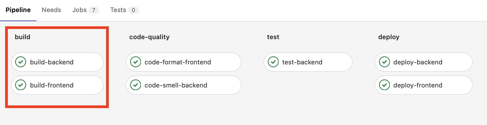

## ▪️Test 

we are using JUnit, a popular open-source testing framework for Java, to test our application. We have integrated JUnit tests into our CI pipeline by running the "mvn test" command, which invokes the Maven build tool to execute the tests.

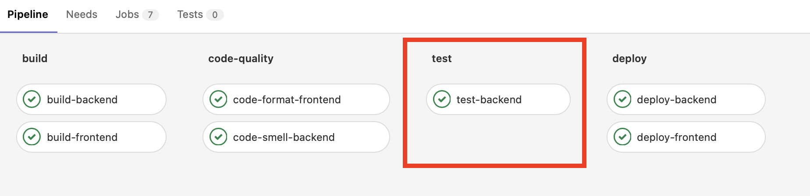

## ▪️Code Quality 

The Continuous Integration (CI) Pipeline of the application includes a stage for code quality assurance, which covers both the frontend and backend code. 
- Job1: The frontend code quality is ensured by integrating prettier into the pipeline, which checks for proper formatting of the codebase. 
- Job2: The backend code quality is evaluated by running designated code smell tools, which generate reports of potential issues in the code. These code smell reports are then saved in artifacts, which can be downloaded later to analyze the code in detail.

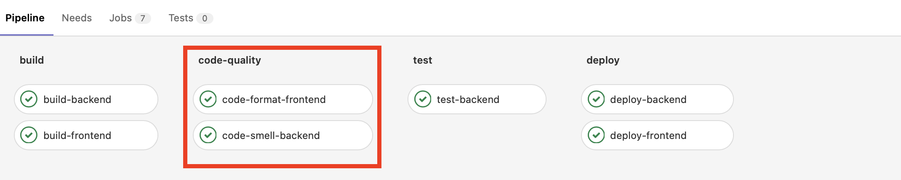

# ☑️ Test 

## ▪️Coverage 

## ▪️Integration tests 

## ▪️Test best practices 

## ▪️TDD adherence  

# ☑️ Quality 

# ☑️ Quality 

## ▪️Design principles 

<h4> Single Responsibility Principle </h4>

 The Single Responsibility Principle dictates that a class should have a singular responsibility, promoting the separation of concerns and facilitating the modification, testing, and reuse of code. This principle is being adhered to in several instances where we are creating distinct controllers and services for various stakeholders. 

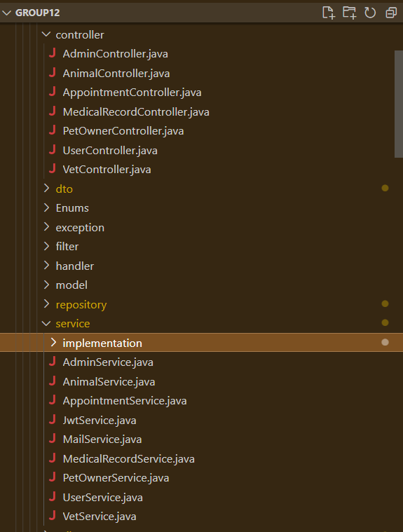

Figure 1: depicting we have different controller and services for different stakeholders

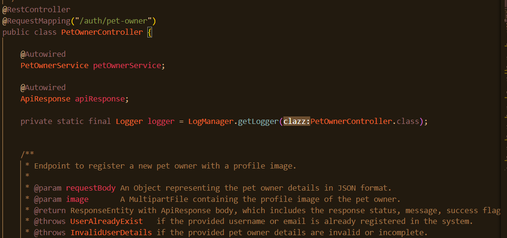

Figure 2: This is the pet controller which have pet owner related methods

<h4>Open/Closed Principle (OCP) </h4>

"A class should be open for extension but closed for modification" means that a class's behavior can be extended without modifying its source code. We have implemented this principle in our application by creating separate classes for different types of users, such as VetDto and PetOwnerDto, which extend the parent UserDto class. This allows us to add new attributes specific to each type of user without modifying the UserDto class directly.

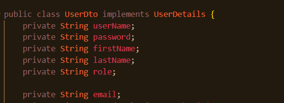

Figure 3: UserDto class [parent class which is open of extension and close for modification]

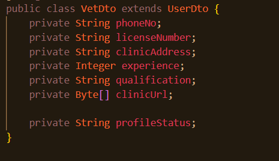

 Figure 4: VetDto which is child class of userdto

 Figure 5: PetOwnerDto which is child class of userdto 

<h4>Liskov Substitution Principle (LSP)</h4>

Subtypes should be able to replace their base types without changing the correctness of the program. As a result, we ensure that if any class implements an abstract class or interface, it can fully replace its parent class.

<h4>Interface Segregation Principle (ISP)</h4>

The Interface Segregation Principle advocates for the use of smaller, more specialized interfaces instead of larger, more complex ones. This approach enables easier maintenance, testing, and code reuse. To implement this principle, we have designed separate interfaces for specific tasks. For example, we have a dedicated mail service interface responsible solely for sending mails, without including unnecessary methods that users would have to implement during implementation. By segregating interfaces in this way, we ensure that our application remains organized and manageable.

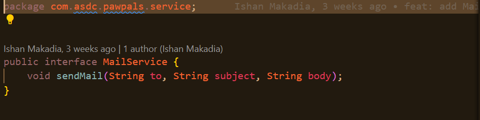

Figure 6: MailService interface which is responsible for mail related task

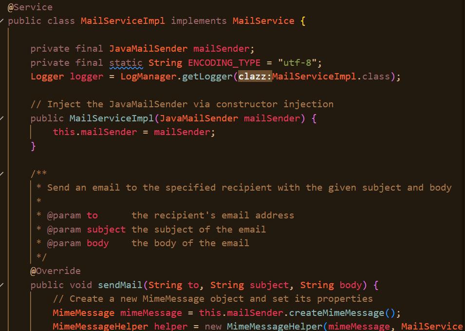

Figure 7: class implementing mail service

<h4>Dependency Inversion Principle (DIP)</h4>

To promote modularity and extensibility, the principle suggests that modules should rely on abstractions such as interfaces and abstract classes. To reduce dependencies on individual classes and decouple the components, we employ numerous interfaces and classes. As we're using Spring Boot for our application, we don't need to be too concerned about this principle because the framework is based on Solid principle.

## ▪️Architecture smells 
### The following architecture smells were detected while running designite -
### 1. Vet Flow
- Package - (VetController.java) com.asdc.pawpals.controller; (VetServiceImpl.java) com.asdc.pawpals.service
- Status - Resolved
- Comments - Initially, this package had two distinct responsibilities, namely managing the vet and handling the appointments made by pet owners to meet with the vet. However, this led to a concentration of features within the package, resulting in a code smell known as Feature Concentration. To address this issue, the package was refactored by splitting the vet flow, including the controller, service, and repository, into two separate flows: appointment and vet. This separation effectively resolved the Feature Concentration smell, allowing for a more modular and maintainable codebase.

### 2. com.asdc.pawpals.utils
- Package - com.asdc.pawpals.utils
- Status - not resolved
- Comments - This is the standard way springboot applications are classified, hence the smell cannot be resolved

### 3. com.asdc.pawpals.model
- Package - (VetController.java) com.asdc.pawpals.controller; (VetServiceImpl.java) com.asdc.pawpals.service
- Status - Resolved
- Package - com.asdc.pawpals.model
- Status - not resolved
- Comments - In Java Spring Boot applications, there are certain code smells that may arise, one of which is feature concentration. This is characterized by the presence of all the models of a class within the models package. However, it should be noted that this code smell cannot be resolved, as it is inherent in the way Spring Boot applications are structured. The layer-wise structure of the project, which is widely recognized and followed in the industry, includes the separation of concerns and the organization of related functionalities into packages. In particular, the models package typically contains all the entity classes that represent the domain objects of the application. This concentration of related features within a single package enhances the maintainability and readability of the codebase, making it easier for developers to navigate and understand the project. Thus, while feature concentration may initially be perceived as a code smell, it is actually a deliberate and beneficial design choice in the context of Java Spring Boot applications.

### The detailed excel sheet can be found here 
- The color codes are explained in the second page of the excel sheet.
- The Excel sheet : [ArchitectureSmellsColor.xlsx](./documents/excelSheets/ArchitectureSmellsColor.xlsx)
- preview - 

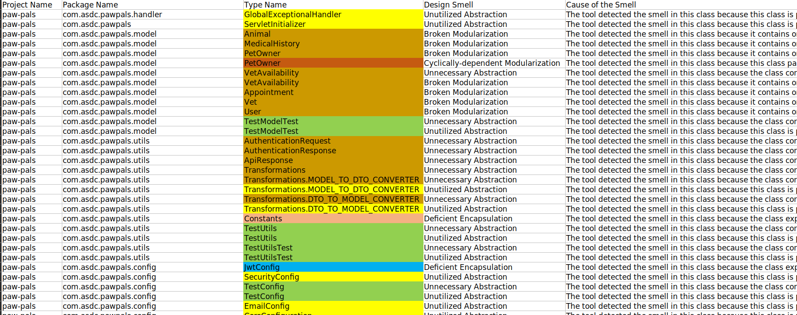

## ▪️Design smells 
### The following design smells were detected while running designite -
### 1. TestModelTest 
- Package - com.asdc.pawpals.model
- Class - TestModelTest
- Status - Resolved
- Comments - This class was not used in the implementation and hence was deleted from the project.

### 2. TestUtils
- Package - com.asdc.pawpals.utils
- Class - TestUtils
- Status - Resolved
- Comments - This class was not used in the implementation and hence was deleted from the project.
### 3. MedicalHistory 
- Package - com.asdc.pawpals.model
- Class - MedicalHistory
- Status - Not resolved
- Comments - The classes have getters/ setters implemented through lombok. The classes have hidden getters and setters set through Lombok, using the @getter @setter anotation.

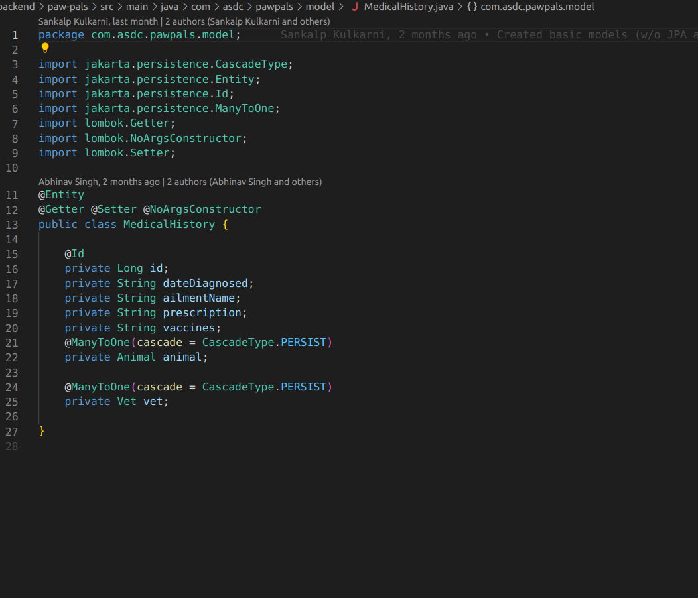

### 4. Animal 
- Package - com.asdc.pawpals.model
- Class - Animal
- Status - Not resolved
- Comments - The classes have getters/ setters implemented through lombok. The classes have hidden getters and setters set through Lombok, using the @getter @setter anotation.

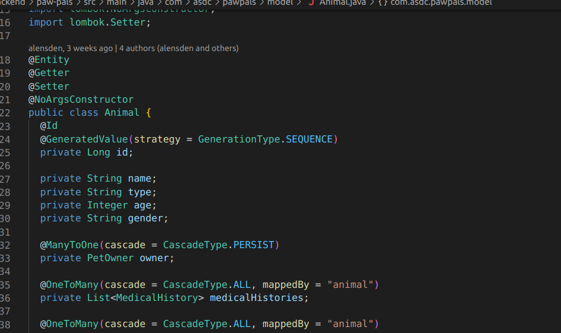

### 5. PetOwner 
- Package - com.asdc.pawpals.model
- Class - PetOwner
- Status - Not resolved
- Comments - The classes have getters/ setters implemented through lombok. The classes have hidden getters and setters set through Lombok, using the @getter @setter anotation. These are JPA related cyclic dependencies, can not change the relationships

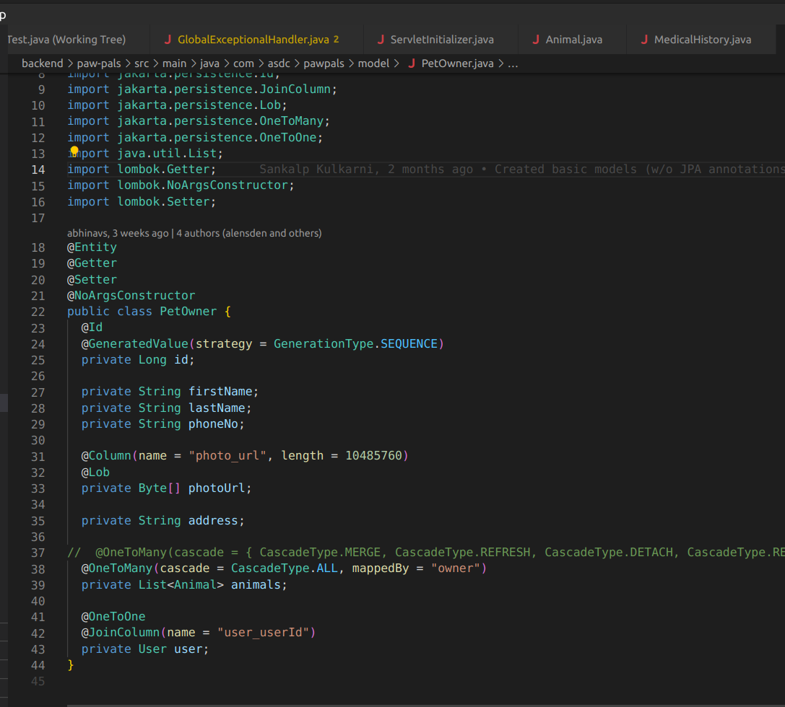

### 6. TestUtilsTest
- Package - com.asdc.pawpals.utils
- Class - TestUtilsTest
- Status - Resolved
- Comments - This class was not used in the implementation and hence was deleted from the project.

### 7. TestConfig
- Package - com.asdc.pawpals.config
- Class - TestConfig
- Status - Resolved
- Comments - This class was not used in the implementation and hence was deleted from the project.

### 8. TestControllerTest
- Package - com.asdc.pawpals.controller
- Class - TestControllerTest
- Status - Resolved
- Comments - This class was not used in the implementation and hence was deleted from the project.

### 9. GlobalExceptionalHandler
- Package - com.asdc.pawpals.handler
- Class - ServletInitializer
- Status - Not resolved
- Comments - These classes are utilized by either other packages or by Spring Boot. They have been specifically designed to support Spring Boot with various functionalities. The classes have been utilized by various classes in the implementation. 
This class is directly used by spring boot, as it extends SpringBootServletInitializer
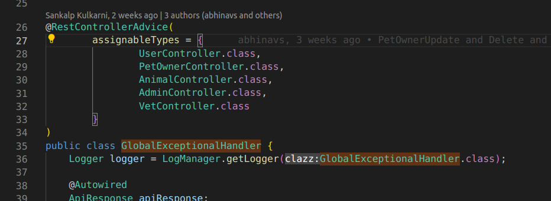

### 10. ServletInitializer
- Package - com.asdc.pawpals
- Class - ServletInitializer
- Status - Not resolved
- Comments - These classes are utilized by either other packages or by Spring Boot. They have been specifically designed to support Spring Boot with various functionalities. The classes have been utilized by various classes in the implementation. 
Spring boot uses assignables types to raise exception.
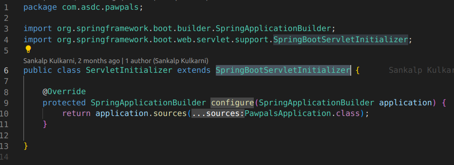

### The detailed excel sheet can be found here 
- The color codes are explained in the second page of the excel sheet.
- The Excel sheet : [DesignSmellsColor.xlsx](./documents/excelSheets/DesignSmellsColor.xlsx)
- preview - 

## ▪️Implementation smells 

### The following implementation smells were detected while running designite -

### 1. testGlobalUserExceptionHandlerForNoPetRegisterUnderPetOwner
- Package - com.asdc.pawpals.handler
- Class - GlobalExceptionalHandlerTest
- Method -        
testGlobalUserExceptionHandlerForNoPetRegisterUnderPetOwner
- Status - Cannot be resolved
- Comments - The statement cannot be decomposed further.
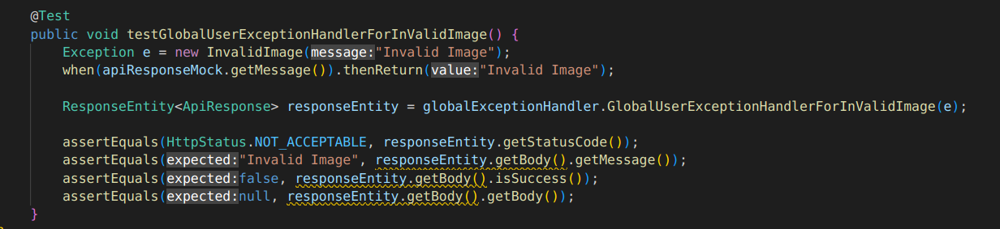

### 2. testGettersAndSetters
- Package - com.asdc.pawpals.handler
- Class - VetAvailabilityTest
- Method -        
testGettersAndSetters
- Status - Cannot be resolved
- Comments - There is a potential issue with the way the values are being passed to the setter of the VetAvailability entity. However, in this particular test case, the code is already quite readable because the setter explicitly states the field into which the variable is being entered.

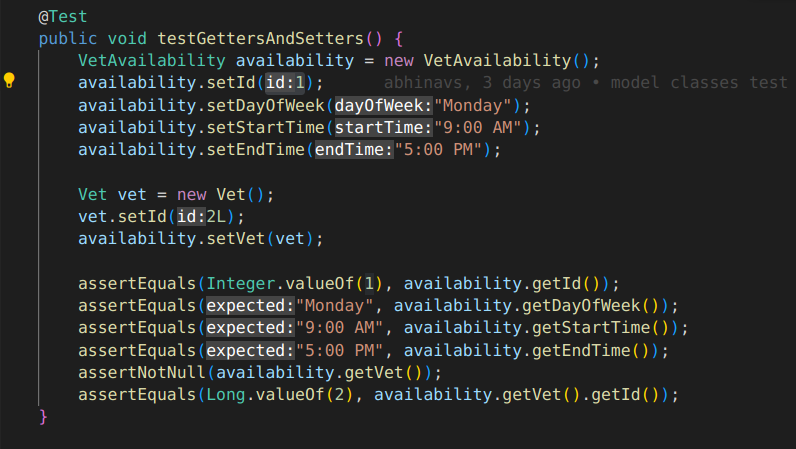

### 3. testSetAndGetAge
- Package - com.asdc.pawpals.model
- Class - AnimalTest
- Method -        
testSetAndGetAge
- Status - Cannot be resolved
- Comments - There is a potential issue with the way the values are being passed to the setter of the VetAvailability entity. However, in this particular test case, the code is already quite readable because the setter explicitly states the field into which the variable is being entered.
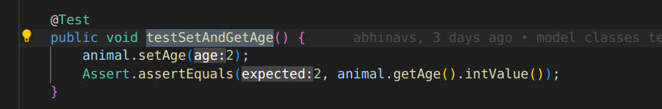

### 4. setUp
- Package - com.asdc.pawpals.model
- Class - VetTest
- Method -        
setUp
- Status - Cannot be resolved
- Comments - There is a potential issue with the way the values are being passed to the setter of the VetAvailability entity. However, in this particular test case, the code is already quite readable because the setter explicitly states the field into which the variable is being entered.

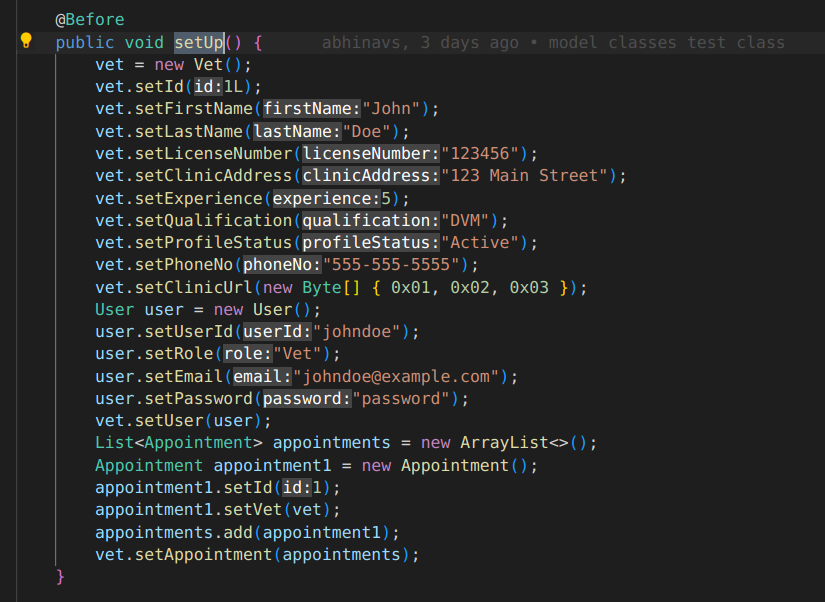

### 5. testGettersAndSetters
- Package - com.asdc.pawpals.model
- Class - VetTest
- Method -        
testGettersAndSetters
- Status - Cannot be resolved
- Comments - There is a potential issue with the way the values are being passed to the setter of the VetAvailability entity. However, in this particular test case, the code is already quite readable because the setter explicitly states the field into which the variable is being entered

### 6. isValidAppointment
- Package - com.asdc.pawpals.validators
- Class - AppointmentValidators
- Method -        
isValidAppointment
- Status - Done
- Comments - By incorporating variables with clear and descriptive names, we were able to enhance the readability of the code that previously contained a lengthy return statement. Previously, the return statement had multiple function calls and logical operators, making it challenging to comprehend the code's intended purpose. However, by storing the function results in these variables, we were able to simplify the code and make it more straightforward. As a result, the newly modified code is now more intuitive and easier to understand.

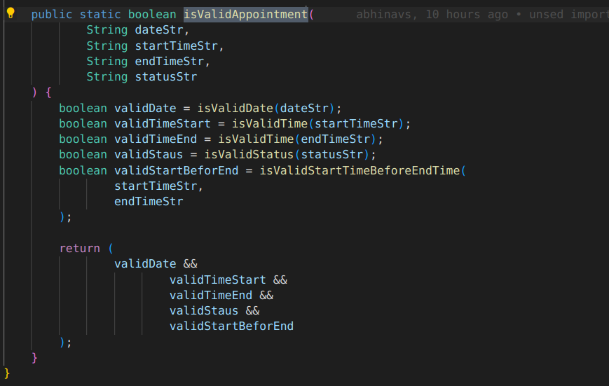

### 7. createToken
- Package - com.asdc.pawpals.config
- Class - JwtConfig
- Method -        
createToken
- Status- Done (⅔ smells )
- Comments - The lengthy statement could not be simplified as it must adhere to the JWT authentication requirement. Additionally, the code contained magic numbers, i.e., hard-coded values that made it difficult to comprehend. To improve readability and understanding, these values were stored in constants, thereby resolving the code smells.

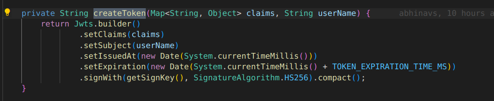

### 8. securityFilterChain
- Package - com.asdc.pawpals.config
- Class - SecurityConfig
- Method -        
securityFilterChain
- Status- Done (⅔ smells )
- Comments - The return statement in the securityFilterChain cannot be refactored due to the nature of the method. The method is using the builder pattern to configure the HTTP security and create a security filter chain.
The long statement is a result of method chaining, where each method call returns the same object (http), allowing subsequent method calls to be chained. The resulting code is concise and easy to read once familiar with the pattern.

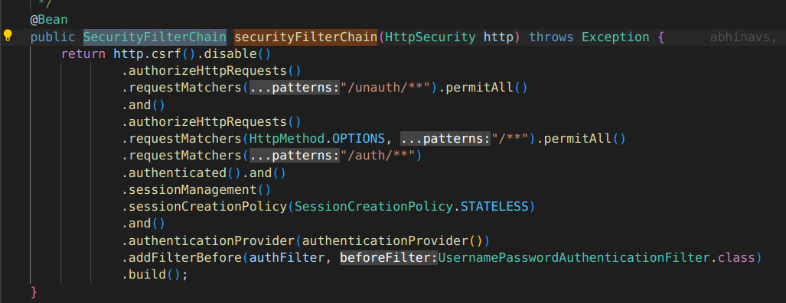

### 9. addCorsMappings
- Package - com.asdc.pawpals.config
- Class - CorsConfiguration
- Method -        
addCorsMappings
- Status- Partially resolve (½)
- Comments - The long statement in the addCorsMappings method may be difficult to remove without affecting the readability or the functionality of the code. The method is using method chaining to configure the CORS settings in a concise and efficient way. If you try to break the method calls into separate lines, you will end up with a longer and less readable code. Similarly, splitting the method into smaller methods might not be effective as it may not add any clarity to the code, and may even make it more complicated. This also had a magic no smell which was resolved by adding the value to a constant.

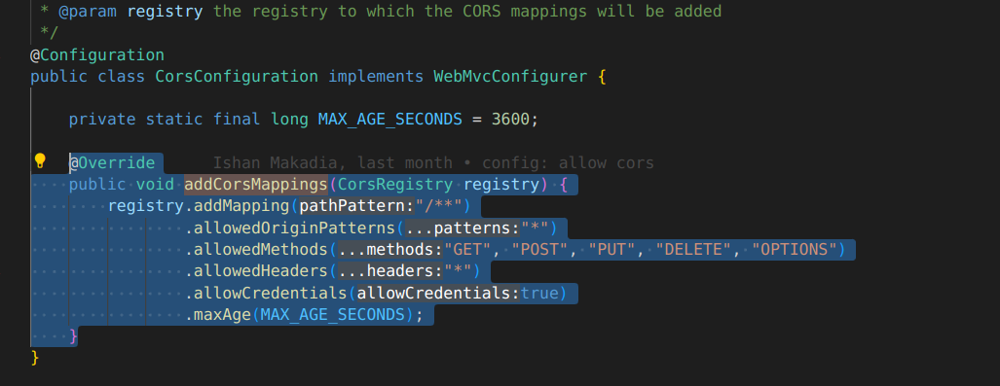

### 10. registerVet
- Package - com.asdc.pawpals.controller
- Class - VetController
- Method -        
registerVet
- Status- Resolved
- Comments - The code contained a complex ternary operator that was difficult to comprehend. However, this issue was resolved by converting it into a simple if-else statement.
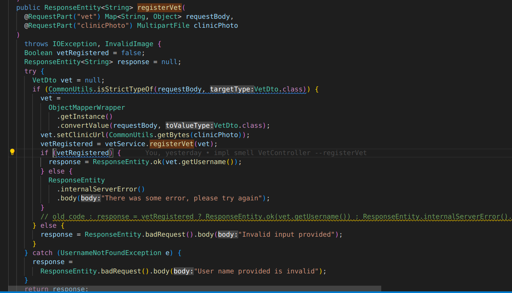

### 11. getAvailablity
- Package - com.asdc.pawpals.controller
- Class - VetController
- Method -        
getAvailablity
- Status- Resolved
- Comments - To simplify a complex conditional statement that contained multiple function calls within an if() condition, the following refactoring approach was taken.

- The statement was decomposed into smaller parts by extracting the values from the function calls and storing them in separate variables. Then, the results of the function calls were stored in a boolean variable that was used in the if() condition statement. This approach helped to reduce the complexity of the original conditional statement and make it easier to understand.

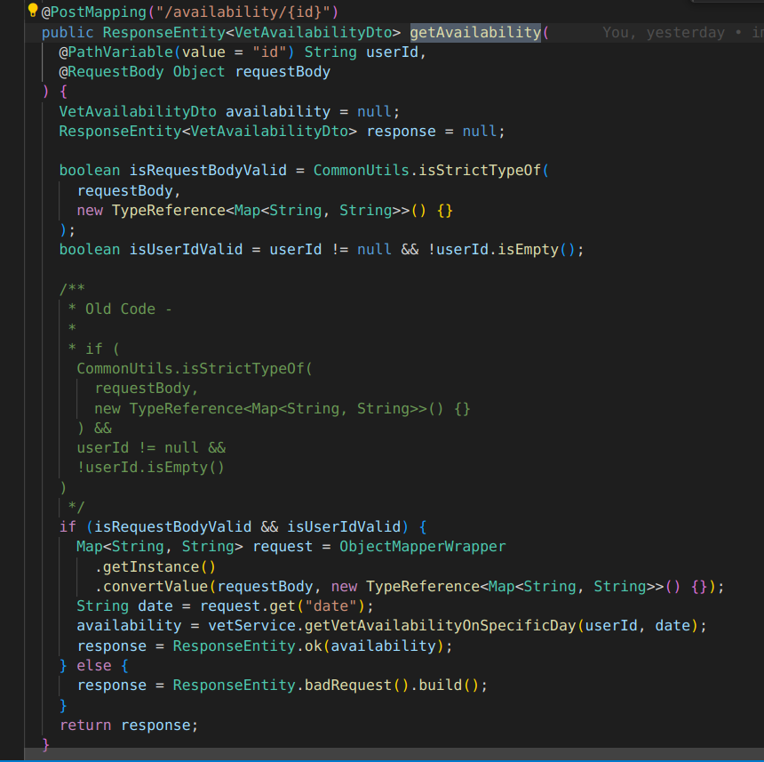

### The detailed excel sheet can be found here 
- Orange - Non resolvable smells
- Green  - Resolved smells
- The Excel sheet : [ImplementationSmellsColor.xlsx](./documents/excelSheets/ImplementationSmellsColor.xlsx)
- preview - 

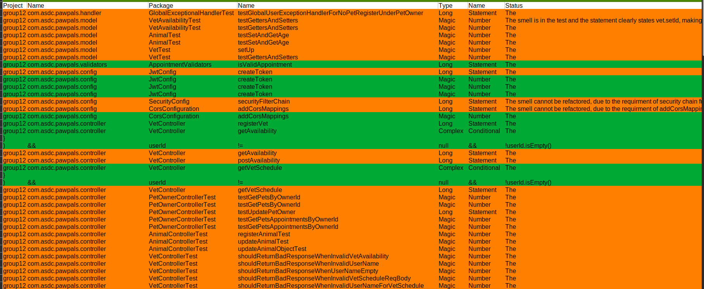

## ▪️Other clean code practices 
1. The application practices defensive programming by checking objects for null values before accessing their internal values.
2. The folder structuring in the application follows a layer-by-layer approach.
3. JavaDocs have been added as documentation to the application.
4. Exception handling in the application is implemented using a eglobal exception handler and Spring Boot Rest Controller Advice.
5. Dynamic casting in the application is achieved using an object mapper.
6. All values in the application undergo semantic validation at runtime using an Appointment Validator.
7. The application utilizes Spring Boot to allow inversion of control and segregating interfaces and their implementation.
8. Enumerations provided by Java are used instead of constant values in the application.
9. Lombok is used in the application to generate getters and setters, resulting in clean and maintainable code.
10. The application abstracts the application layer from the business layer by employing Data Access Objects (DAOs) and Data Transfer Objects (DTOs).
11. Common utilities are extracted throughout the codebase to avoid duplication in the application.
12. All external dependencies and external data are mocked in the application.
13. Both negative and positive flows are tested in the application.
14. When testing controllers, all other dependencies, such as models and utilities, are mocked in the application.
15. The application employs various assert methods during testing.
16. The application undergoes system testing across all folders, including config, controller, dto, enums, exception, filter, handler, model, service, utils, and validator.
17. The frontend libraries utilized in the application are accessed through wrappers, such as axios.
18. API calls from the frontend are segregated from the processing of data from API calls, with the creation of separate files, such as crud.js and processCrud.js.
19. In frontend, Common components are developed and organized into the components folder for reusability in the application.
20. Custom hooks in frontend are created wherever possible to optimize and reuse logic in the application.
21. Context is used in frontend to set the common state, which is utilized throughout the application, to avoid prop drilling.
22. Prettier is integrated into the frontend to maintain consistent formatting of the codebase.
23. The React application is built through Webpack to enable the customization of the whole build process.

# ☑️ Screenshots (Features) 

### Homepage 

### Pet Owner Registration Homepage
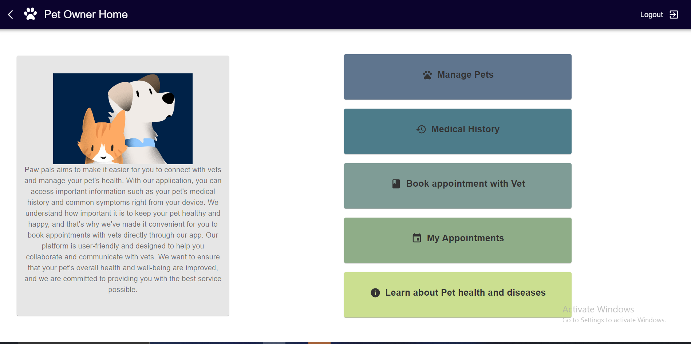

### Pet Owner My Appointment page
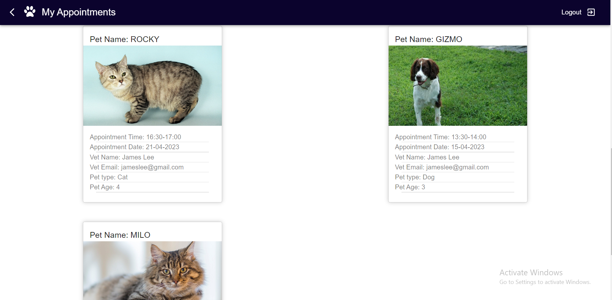

### Add Pet page
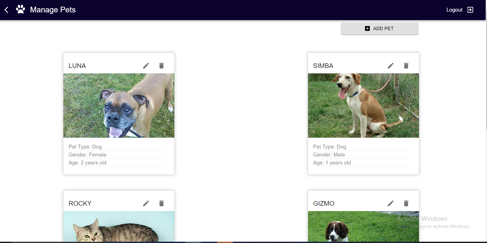

### Admin See All Vets
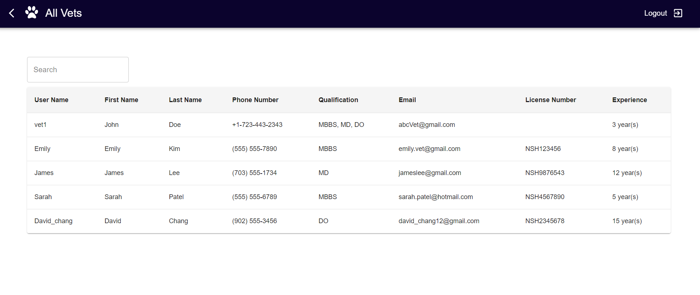

### Admin Homepage
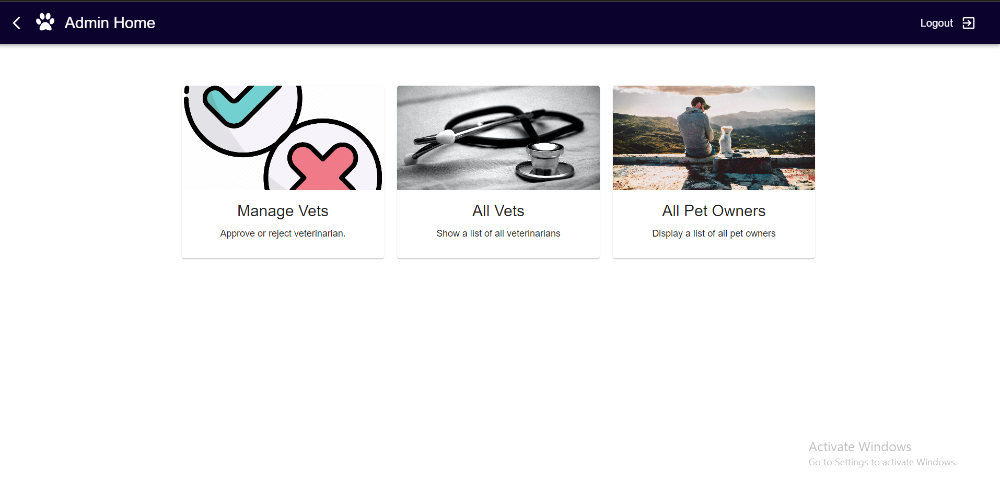

### Admin See All Pet Owner page
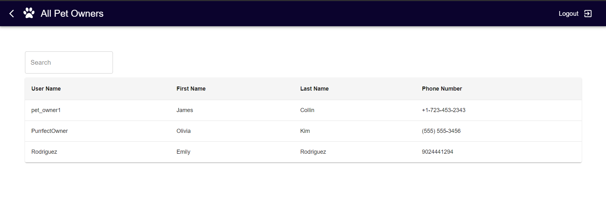

### About Us page
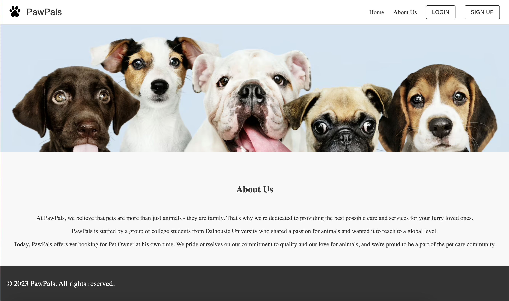

### Admin Vet Approve
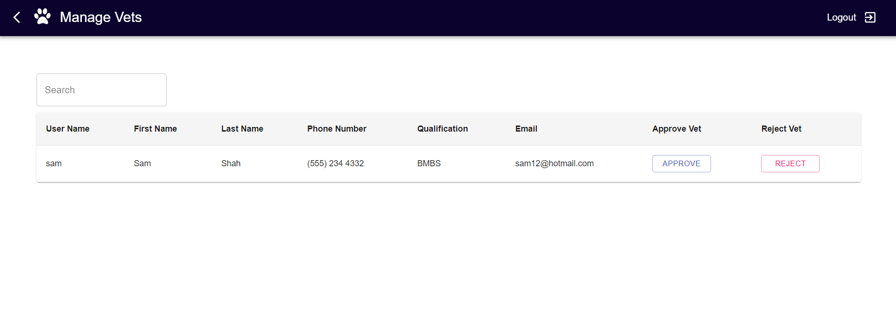

### Appointment Review page
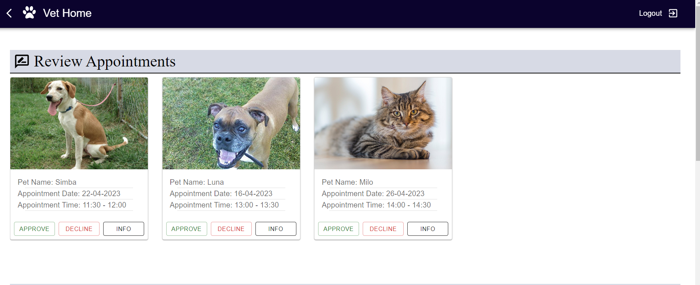

### Completed Appointments page
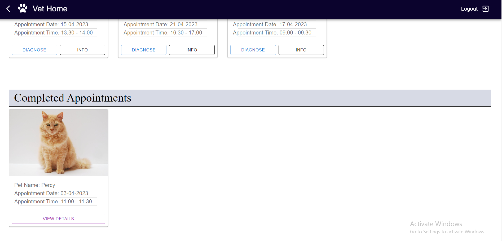

### My Appointment page

### Pet Info page
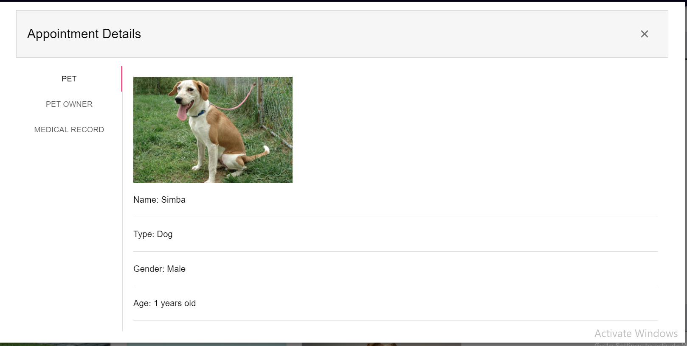

### Sign Up page
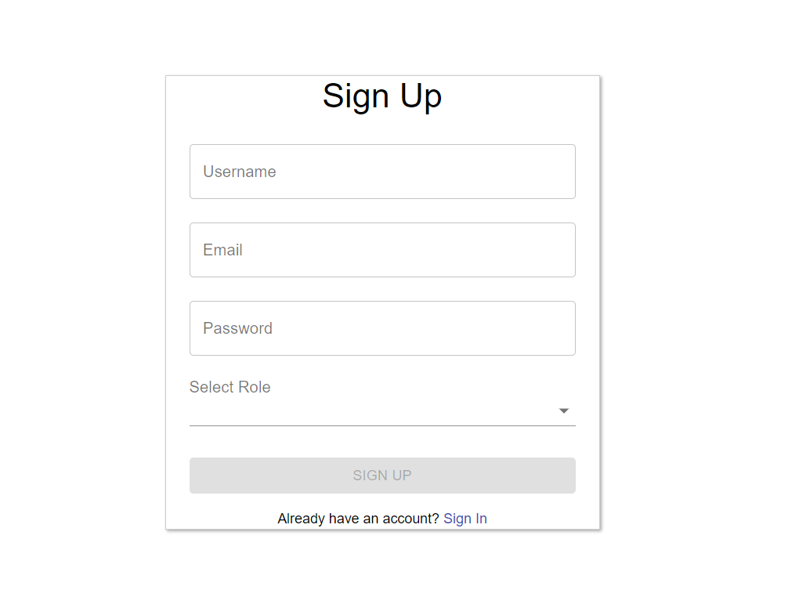

### Upcoming Appointments page
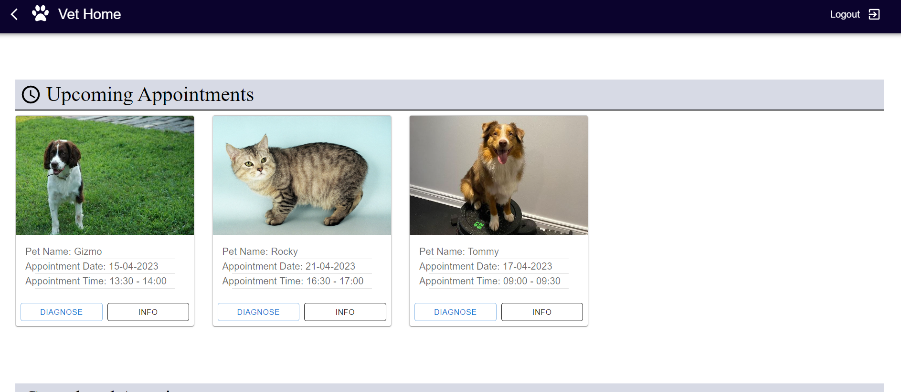

### Appointment Booking page
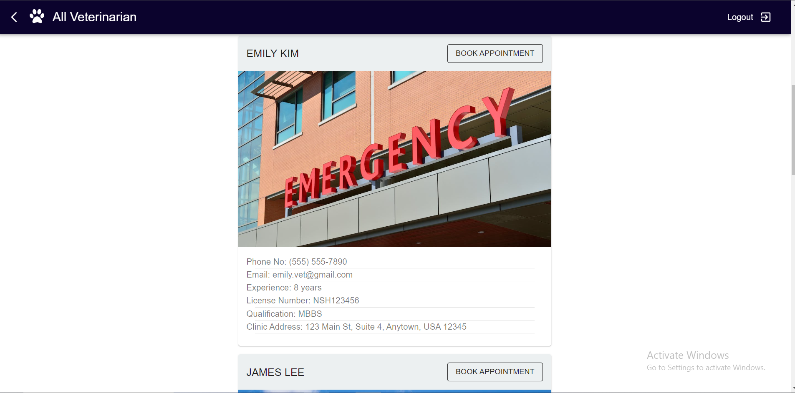
